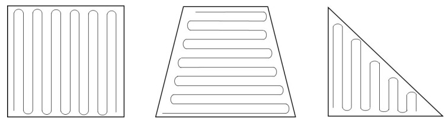
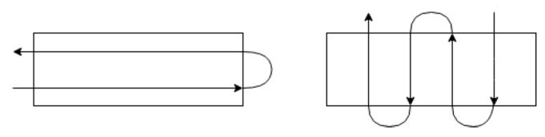
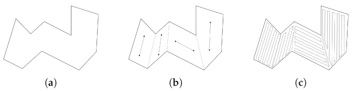
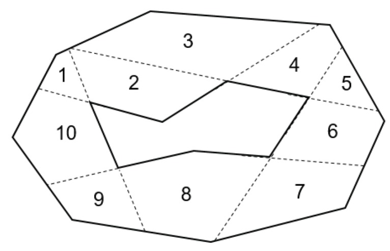
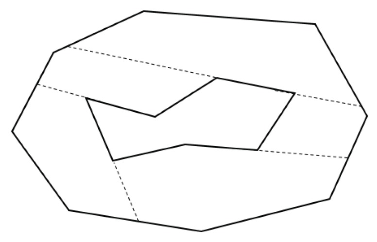

# Coverage Planning 

> Book: 
> - [Planning Algorithm -- Steven M. LaValle](http://lavalle.pl/planning/)
>   - [Boustrophedon decomposition](http://lavalle.pl/planning/node352.html)
>   - [Spanning tree covering](http://lavalle.pl/planning/node353.html)

The coverage planning algorithm here is the main to solve problems in 2D areas. There are two methods explained in this book.

## 1. Boustrophedon decomposition 

> - ref: 
>   - [Convex Decomposition for a Coverage Path Planning for Autonomous Vehicles: Interior Extension of Edges](https://www.ncbi.nlm.nih.gov/pmc/articles/PMC6806237/)
>   - [Coverage Planning Problem and Traveling Salesman Problems](https://etd.auburn.edu/bitstream/handle/10415/4599/Optimization%20Approaches%20for%20a%20Dubins%20Vehicle%20in%20Coverage%20Planning%20Problem%20and%20Traveling%20Salesman%20Problems.pdf?sequence=2)
>   - [Complete coverage path planning in an agricultural environment](https://lib.dr.iastate.edu/etd/12095/)
### 1.1 Overview

#### 1.1.1 Convex ploygon

Boustrophedon means the way ox walks which is the parallel-line-covered areas. The pattern is illustrated in the figure below. 

When the map is a convex polygon, Boustrophedon is easy to be applied in a coverage task. The leading optimization in this part is to reduce turning, as turning costs more energy and time than moving straight. The distance between two parallel lines is called altitude, and the sum of altitude is called width. The minimum turning means the minimum width in the path. Therefore, the problem can be reduced to find the minimum width path with its coordinated direction.

#### 1.1.2 Non-convex ploygon

When the area is complex and concave, the difficulty levels up. One approach for a complex map is to decompose it into convex subareas. Then apply boustrophedon to each sub-area and connect this coverage path sub-area to complete the entire coverage path plan. The optimal path for each sub-area can still use the minimum width principle. Then the connection of each track in the sub-area can be formulated as a Traveling Salesman Problem. What we need to do is to minimize the times the robot visit all the sub-area.

### 1.2 Decomposition method 

There are many ways to decompose a non-convex polygon. The following paragraph introduces some of them.

#### 1.2.1 [Interior Extension of Edges](https://www.ncbi.nlm.nih.gov/pmc/articles/PMC6806237/)

Interior Extension of Edges starts by determining if the internal angle between two edges of a target polygon is more than 180 degrees. Then extend the edges of those picked angles until they hit the boundaries of the map, as illustrated below.

After that, the neighbor sub-polygons need to be merged to reduce sub-areas. The principle of this process the merged polygons are convex. In this process, we can get a set of merge options. Among them, The best option is the one with minimum total width.   

#### 1.2.2 Quick Optimal Path Plan Overview

**Input:** 

- The Polygon's boundary edge that stored as two connected points.

**Output:** 
- The boundary of subregions.
- The path direction for each subregion.
- The total coverage cost.

**Procedure:**

- Determine the optimal overall coverage direction.
  - Minimum turns
- Decompose the boundary into trapezoid-shaped regions.
  - Decompose the polygon to trapezoidal regions by adding a vertical line at each vertex.
- Calculate optimal coverage for each region.
- Merge regions.
  - Processing the adjacent regions from right to left, checking adjacent areas to determine if it is more cost-effective to merge the areas or leave them separate.
- Return the optimal result.
### 1.3 Algorithm

#### 1.3.1 Convex Ploygon

#### 1.3.2 Non-convex Ploygon

### 1.4 Code

> ref: [RicheyHuang/CoveragePlanner](https://github.com/RicheyHuang/CoveragePlanner)