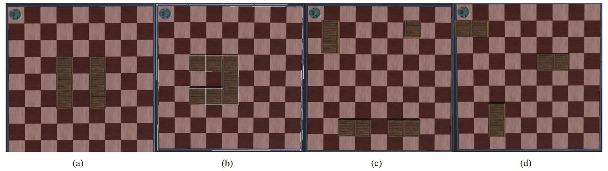
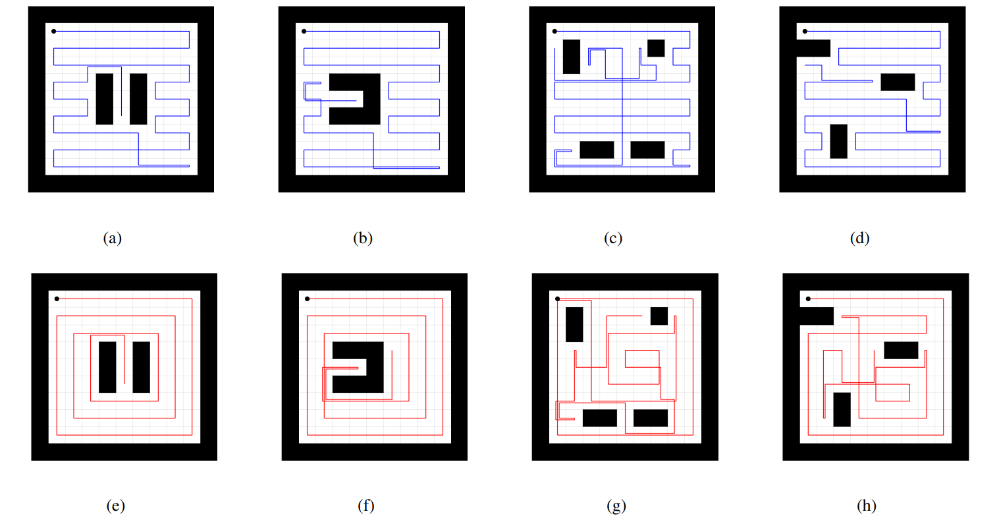
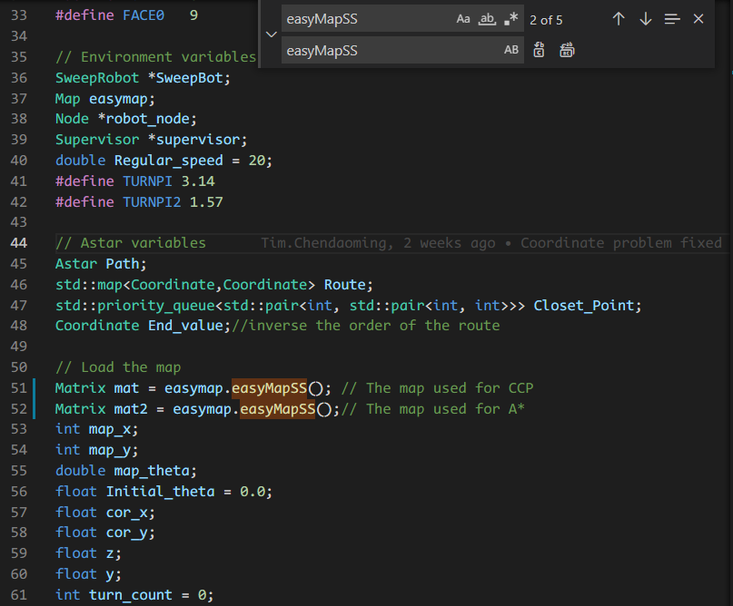
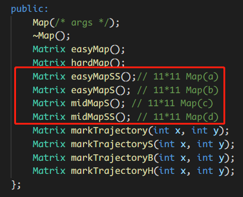
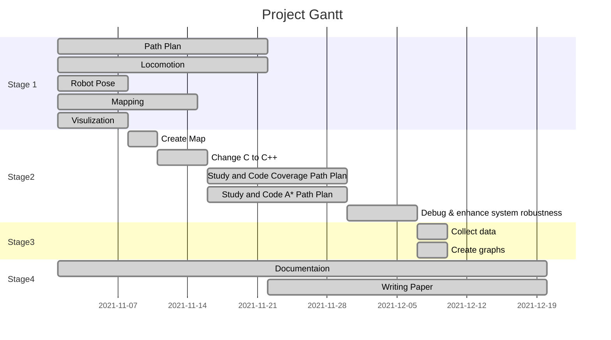

# Two Different Complete Coverage Path Planning Algorithms Comparation in Webots

The complete coverage path planning algorithm is a method that allows mobile robots to traverse each point in a known map environment. A classic application of this algorithm is a scene where a vacuum robot autonomously cleans an area. This article compared the efficiency of the Boustrophedon  Cell  Decomposition(BCD) algorithm and the Backtracking Spiral Algorithm (BSA) algorithm on the Webots simulation platform using E-puck autonomous mobile robot. The experiments are carried out in 5 kinds of grid map simulation environments. Experimental results show that it is more efficient to use Boustrophedon Cell Decomposition algorithm in most environments.

## Introduction:

The flow chart of CPP algorithm is shown below:

The results:

The experimential maps used in this project.

The trajectory results for the maps.

[Video results](https://www.youtube.com/watch?v=0otNrg9-y_8&list=PLDFZ7pvu5Ykhd1IlsfWVeFoPCi_1xtch7&ab_channel=DAOMINGCHEN)

## Quick Access:
- [Robot_Workfolder](https://github.com/Alexbeast-CN/Robot_navigation_webots/tree/main/Robot_Workfolder): Keeps the all developed fiels.
  - Controllers
    - [BSA](https://github.com/Alexbeast-CN/Robot_navigation_webots/tree/main/Robot_Workfolder/controllers/BSA): BSA algorithm controller.
    - [Initial](https://github.com/Alexbeast-CN/Robot_navigation_webots/tree/main/Robot_Workfolder/controllers/Initial): BCD algorithm controller.
  - [Worlds](https://github.com/Alexbeast-CN/Robot_navigation_webots/tree/main/Robot_Workfolder/worlds): Keeps all the webots projects and world.
- [Results](https://github.com/Alexbeast-CN/Robot_navigation_webots/tree/main/Results): Keeps all the experiment data .
- [Doc](https://github.com/Alexbeast-CN/Robot_navigation_webots/tree/main/Doc): Keeps all the development log.
- [RS_Report](https://github.com/Alexbeast-CN/Robot_navigation_webots/tree/main/RS_Report): Keeps all the figures and the report in latex.

## Usage:

Before running the controller in webots, make sure to load the right map in main function.

The 4 maps showed in introduction are namely:

## Project Agenda:

> To view the graph below please add [GitHub + Mermaid extension](https://github.com/BackMarket/github-mermaid-extension) to your browser.

Ps:
- Stage 1: Decision-making stage
- Stage 2: Skill-building & API programming stage
- Stage 3: Experiment stage
- Stage 4: Documentation stage