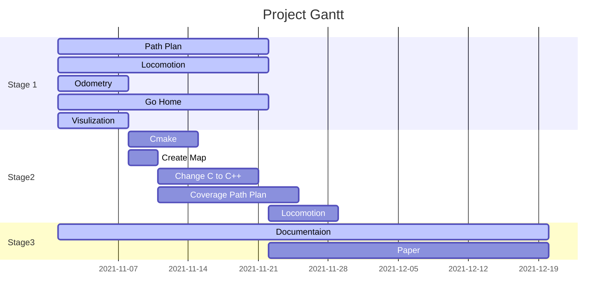

# Robot Navigation 

This project uses Webots as a simulator to test path planning algorithms for an indoor robot.

The project is in progress.

## Project Agenda:

> To view the graph below please add [GitHub + Mermaid extension](https://github.com/BackMarket/github-mermaid-extension) to your browser.

Ps:
- Stage 1: Decision-making stage
- Stage 2: Skill-building & API programming stage
- Stage 3: Documentation stage

## Quick Access

- [View Source Code](https://github.com/Alexbeast-CN/Robot_navigation_webots/tree/main/Controller)
- [Notes](https://github.com/Alexbeast-CN/Robot_navigation_webots/tree/main/Doc/Useful%20Knowlege)
- [Formal Report](https://github.com/Alexbeast-CN/Robot_navigation_webots/tree/main/RS_Report)