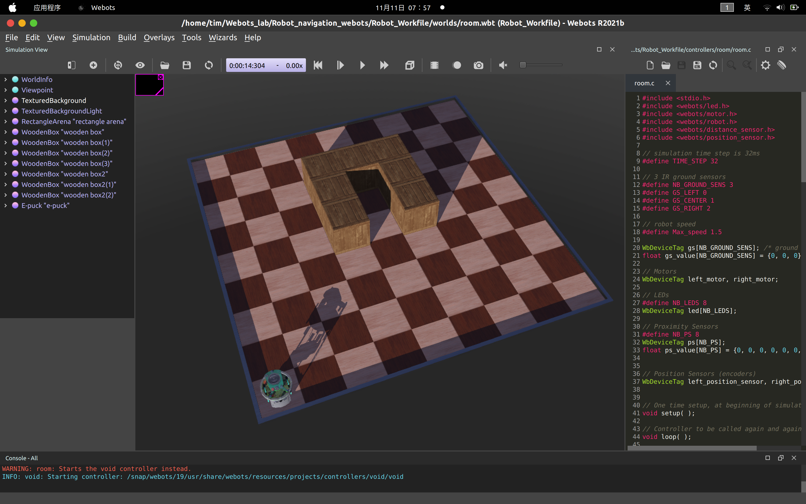

# Robot Workfile

## Task 1

The following figure shows the map called "easy". This is the first map for our robot. The robot need to plan its path to cover this map and go back to the home position after that. 

